# PROYECTO DATADASHBOARD

**Organización del grupo de trabajo**

En la organización se utilizó las siguientes herramientas:

+ Sprint Board Manual
+ Trello (Sprint Board Digital)
+ Pair Progamming
+ Feedback entre grupo y usuario final

En la organización del Sprint Board Manual, se llevó a cabo con un grupo mayor de trabajo (6 personas y 2 couches), se identificó las fases del proyecto.

La organización del grupo de trabajo (2 personas), se organizó a través de un Sprint Board Digital (Trello), Lo cual poniendo horarios y metas, se avanzó con mayor claridad.
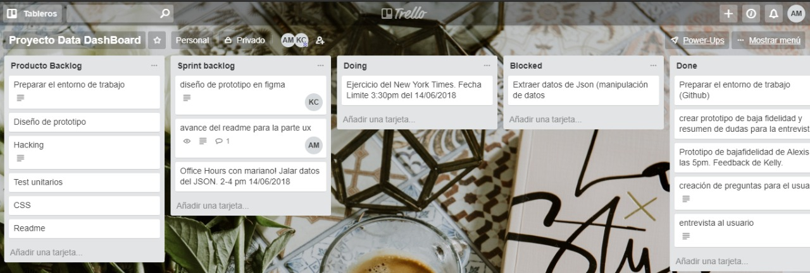

El uso del Pair Progamming, nos ayudó a indentificar y solucionar dudas tecnologicas y compartir ideas.

El feedback, nos ayuda a tener más claro la interactividad, la sencillez de la interfaz, soluciones y desaciertos de los prototipos de baja fidelidad.

## USER EXPERIENCE DESIGN

#### 1)User Experience Design

Este proyecto va dirigido hacia los MANAGER TRAINNIG, quién se encargan del progreso de una gran cantidad de personas en un tiempo limitado.

**Objetivos del proyecto**

+ Utilidad
+ Manejo intuitivo
+ Rapidez
+ Responsive
+ Cumplir con la marca de la empresa

**Datos Gráficos Relevantes**
A través de la entrevista, pudimos obtener lo que el usuario necesitaba y se obtuvo los siguientes resultados:

+ Vista general a la izquierda 
+ Listado de alumnas de Laboratoria
+ Resumenes de avance por cursos
+ Avance particular de cada alumna
+ Interfaz sencilla
+ Frecuencia diaria del uso al ingreso y salida de las alumnas.

**Proceso de Diseño**

Al comienzo del proyecto teníamos ideas diferentes en el grupo de desarrollo, se conversó sobre los ítems obligatorios que debería de tener los prototipos de baja fidelidad. Teniendo como prioridad un ambiente sin restricciones se decidió hacer dos primeros prototipos y hacer feedback entre el equipo.  El documento muestra la evolucion de los bocetos y la decision en grupo sobre el producto final luego de la revisión del usuario.

#### 2) Sketch de la Solución (Prototipos de baja fidelidad)

**Prototipos 1**
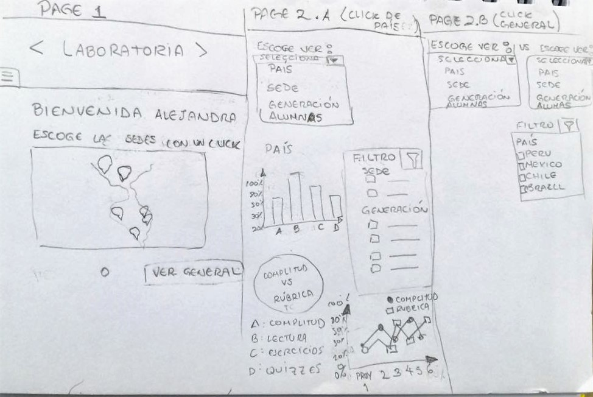 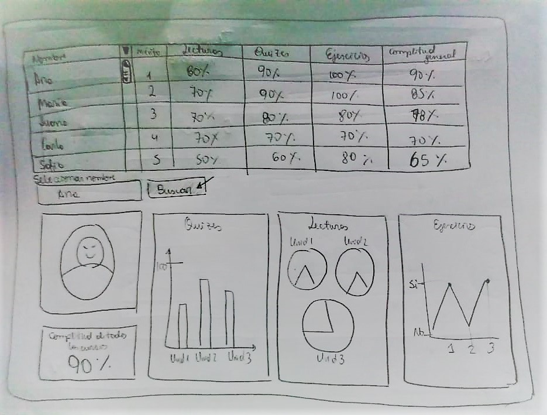 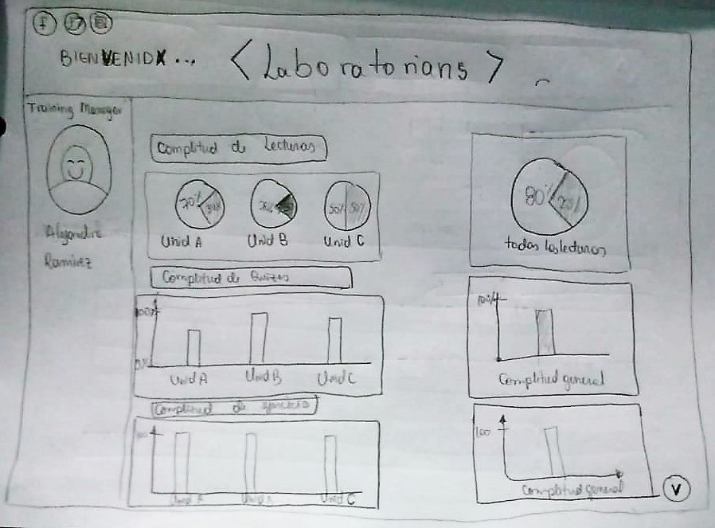

**Prototipos 2**
*Primer feedback*
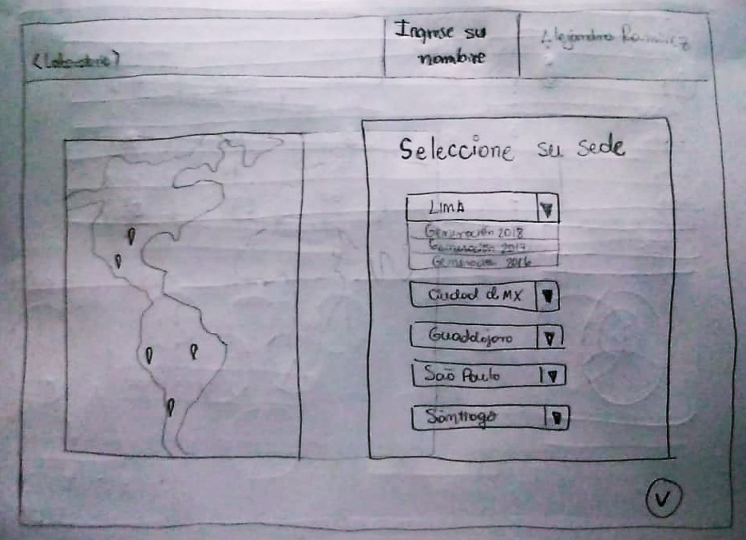 

**Prototipo 3**
*Prototipos para la entrevista y coordinación de los productos finales*
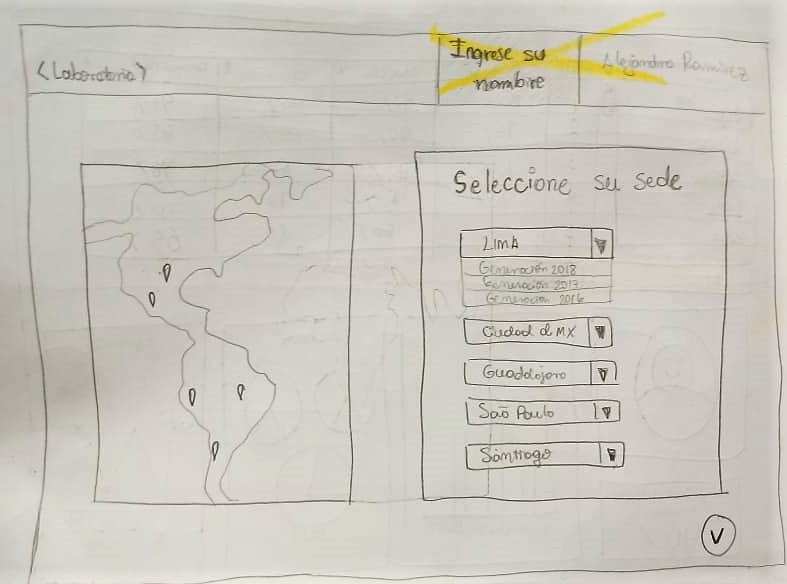 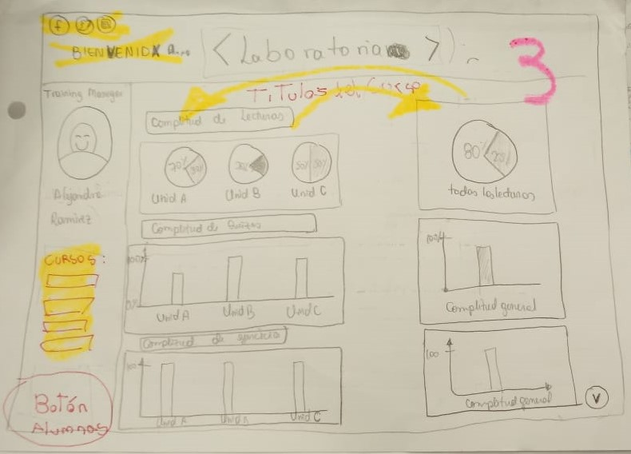  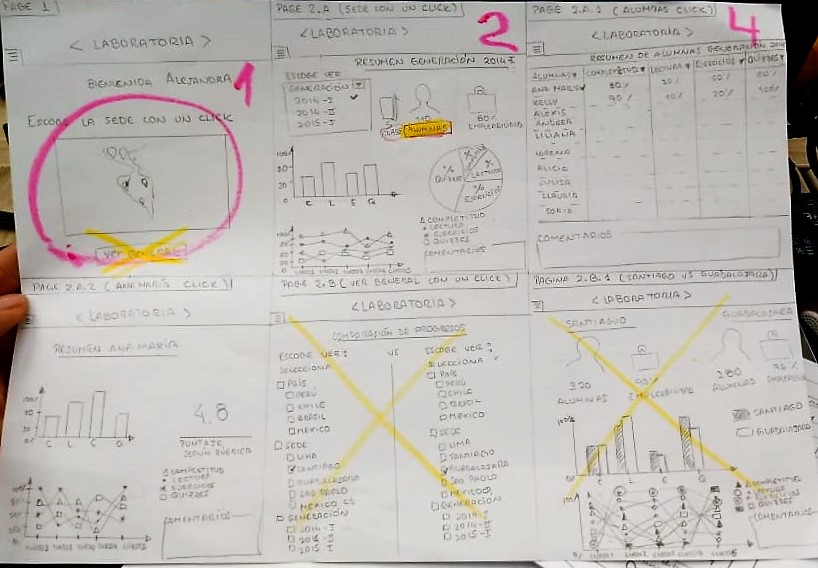

**Prototipo 4**
*Prototipo final de baja fidelidad, Luego de la entrevista con feedback del usuario*
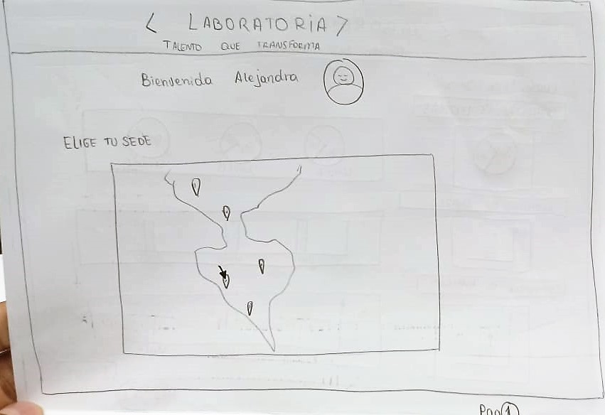 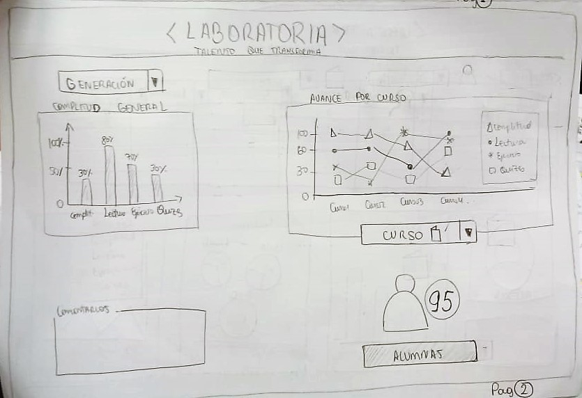 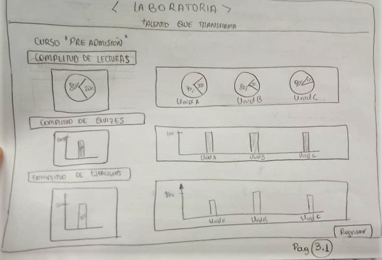 

#### 3) Diseño de la Interfaz de Usuario (Prototipo de alta fidelidad)

